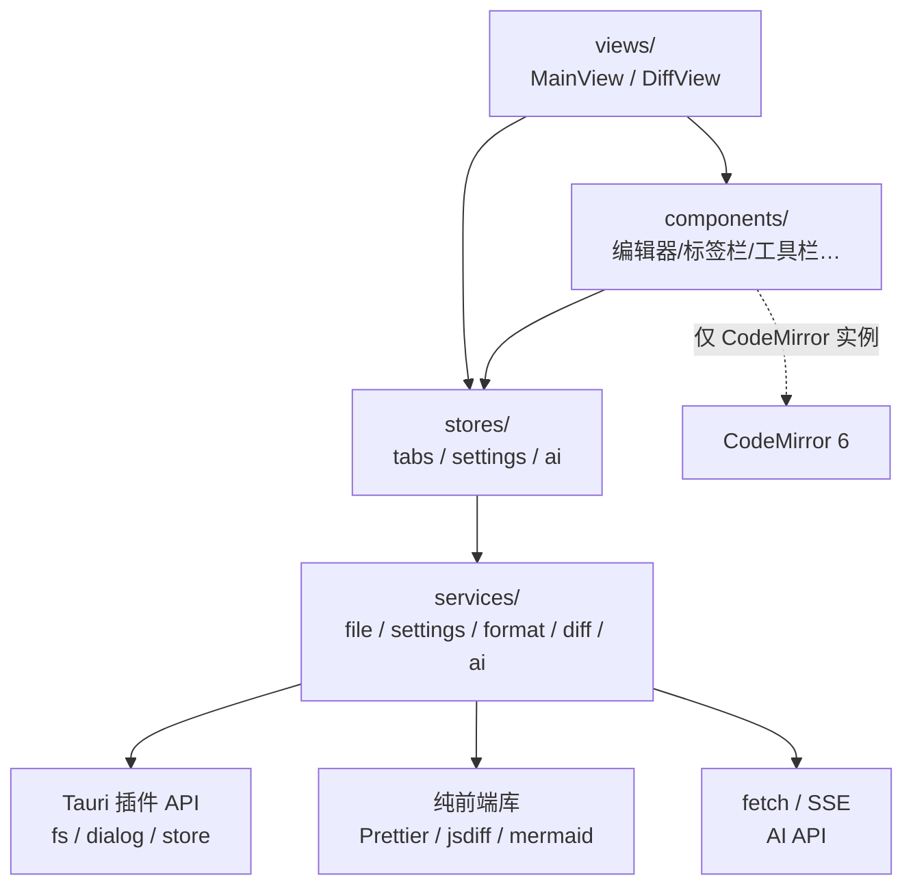

# aida-note 系统架构设计（ARCH-1）

> 版本：v1.0 · 2026-08-20 · Sprint 1
> 依据：PCB 技术栈结论 / SIS-ENV-1 目录结构 / SIS-ENV-2 依赖清单 / SIS-ARCH-1
> 定位：后续全部 FUNC 系列 SIS 的执行依据。本文档只做设计，不含实现。

---

## 1. 架构总览

```
┌─────────────────────────────────────────────────────────┐
│                    WebView（前端，Vue 3）                │
│                                                         │
│  views/          components/        stores/   (Pinia)   │
│  ┌─────────┐     ┌───────────┐     ┌──────────────┐     │
│  │MainView │ ──> │编辑器/标签栏│ ──> │tabs/settings │     │
│  │DiffView │     │工具栏/搜索框│     │/ai 三 Store  │     │
│  └─────────┘     └───────────┘     └──────┬───────┘     │
│                                          │              │
│                 services/（无状态服务层） │              │
│  ┌──────────┬──────────┬─────────┬───────┴──┬────────┐  │
│  │fileService│settings- │format-  │diff-     │ai-     │  │
│  │          │Service   │Service  │Service   │Service │  │
│  └────┬─────┴────┬─────┴────┬────┴────┬─────┴───┬────┘  │
│       │          │          │         │         │       │
│  Tauri 插件 API  │   Prettier  jsdiff  │    fetch(SSE)   │
│  (fs/dialog/store)│      (纯前端库)    │    (AI-1)      │
└───────┼──────────┼──────────────────────┼────────────────┘
        │          │                      │
┌───────▼──────────▼──────────────────────▼────────────────┐
│              Tauri 2 主进程（Rust，最小化）               │
│   仅承载：WebView 容器 + 官方插件宿主 + 系统托盘(可选)    │
│   自定义 Rust 命令：无（零自定义 IPC）                    │
└──────────────────────────────────────────────────────────┘
```

### 核心原则：Rust 侧最小化

- 文件系统操作全部走 **Tauri 官方插件**（fs / dialog / store），不写自定义 Rust 命令。
- 高亮（CodeMirror）、渲染（mermaid）、格式化（Prettier）、对比（jsdiff）、AI（fetch 流式）全部在前端完成。
- 收益：无 Rust 编译负担、无 IPC 类型同步成本、升级 Tauri 版本零迁移成本。
- 例外预案：仅当出现官方插件无法覆盖的能力（如未来全局快捷键、深度系统集成）才新增自定义命令，需先过变更评审（T3）。

---

## 2. 职责划分

| 层 | 职责 | 不做什么 |
|----|------|---------|
| **Rust 主进程** | WebView 容器、插件宿主、权限网关（capabilities） | 不含任何业务逻辑、不写自定义命令 |
| **Tauri 官方插件** | 文件读写（fs）、系统对话框（dialog）、键值持久化（store） | — |
| **services/**（5 个） | 无状态能力封装：IO、设置、格式化、对比、AI 调用 | 不持有响应式状态、不直接操作 UI |
| **stores/**（3 个） | 响应式状态：标签页、设置、AI 会话 | 不含 IO 细节（IO 一律调 service） |
| **components/** | UI 组件：编辑器、标签栏、工具栏、状态栏等 | 不持有跨组件状态（一律走 store） |
| **views/** | 页面编排：主编辑视图、对比视图 | 不做能力封装 |

### services/ 五服务

| 服务 | 封装对象 | 服务对象（SIS） |
|------|---------|----------------|
| `fileService` | plugin-fs + plugin-dialog | FUNC-1 多标签、FUNC-6 对比、FUNC-10/11 |
| `settingsService` | plugin-store（settings.json） | FUNC-8 软换行、FUNC-9 主题、FUNC-11 最近文件、AI-1 API 配置 |
| `formatService` | Prettier standalone + plugins | FUNC-5 格式化（4 语言，SQL 不做） |
| `diffService` | jsdiff（行级 + 字符级） | FUNC-6 文件对比 |
| `aiService` | fetch + SSE 流式 | AI-1 润色/问答/mermaid 修复 |

### stores/ 三 Store（Pinia）

| Store | 状态 | 备注 |
|-------|------|------|
| `tabsStore` | 标签列表、当前激活标签、内容、脏标记、草稿状态 | FUNC-1/10/11 的状态核心 |
| `settingsStore` | 主题、软换行、最近文件、AI 配置（baseURL/key/model） | 与 settings.json 双向同步 |
| `aiStore` | AI 请求状态（loading/流式内容/错误） | AI-1 侧栏交互状态 |

---

## 3. IPC / 插件调用契约表

> 全部为官方插件 API，经 services/ 封装后供 stores/ 调用。前端不得绕过 service 直接调用插件 API。

| # | 操作 | 插件 API | 前端封装（services/） | 调用方 | 权限（capabilities） |
|---|------|----------|----------------------|--------|---------------------|
| 1 | 打开文件对话框 | `dialog.open()` | `fileService.pickFile(): Promise<string \| null>` | tabsStore | — |
| 2 | 保存文件对话框 | `dialog.save()` | `fileService.pickSavePath(): Promise<string \| null>` | tabsStore | — |
| 3 | 读文本文件 | `fs.readTextFile(path)` | `fileService.readFile(path): Promise<string>` | tabsStore / diffService | fs:read（按路径授予） |
| 4 | 写文本文件 | `fs.writeTextFile(path, contents)` | `fileService.writeFile(path, contents): Promise<void>` | tabsStore（保存） | fs:write |
| 5 | 读设置 | `store.get(key)` / `Store.load('settings.json')` | `settingsService.load<T>(): Promise<T>` | settingsStore | — |
| 6 | 写设置 | `store.set(key, value)` + `save()` | `settingsService.save(patch): Promise<void>` | settingsStore | — |
| 7 | 草稿读写（崩溃恢复） | `fs.writeTextFile` / `readTextFile`（固定草稿目录） | `fileService.saveDraft(tabId, content)` / `readDraft(tabId)` | tabsStore（防抖后） | fs（仅草稿目录） |

**权限模型**：`src-tauri/capabilities/default.json` 中按最小权限授予：fs 读写范围限制为「用户自选路径 + 草稿目录 + 设置文件」，不允许全盘 `**`（安全基线）。

**插件引入时机**：fs/dialog/store 三个插件的 npm 包与 Rust crate 在 Sprint 2（FUNC-1 启动）时安装，本文档先行锁定契约。

---

## 4. 模块依赖方向



**依赖规则**（单向，禁止反向/循环）：

1. `views -> components -> stores -> services -> (Tauri API | 第三方库)`
2. components 不直接调用 services（状态变更一律经 store，保持数据流可追踪）。
3. stores 之间可互相引用（Pinia 组合式），services 之间不互相引用（保持无状态独立）。
4. CodeMirror EditorView 实例由编辑器组件持有（DOM 生命周期归属组件），内容同步经 store；mermaid 渲染节点同理。
5. 不引入 vue-router：视图切换 = views 组件条件渲染（对比视图作为主视图的覆盖层态，由 tabsStore/ui 状态驱动）。

---

## 5. 核心数据流：打开 -> 编辑 -> 保存 -> 脏标记

```
【打开】
快捷键/菜单 ──> fileService.pickFile()（dialog 选路径）
           ──> fileService.readFile()（fs 读内容）
           ──> tabsStore.openTab({ path, content })
           ──> Editor 组件装载 CodeMirror doc
           ──> settingsStore.pushRecentFile(path)（FUNC-11，持久化到 settings.json）

【编辑】
用户输入 ──> CodeMirror updateListener
         ──> tabsStore.updateContent(tabId, content)
         ──> isDirty = (content !== savedContent)   // 脏标记，驱动标签圆点与关闭确认
         ──> 防抖 N 秒 ──> fileService.saveDraft()（FUNC-10 草稿）

【保存】
Ctrl+S ──> 无 path？先 fileService.pickSavePath()（另存为）
        ──> fileService.writeFile(path, content)
        ──> 成功：tabsStore.markSaved(tabId)（isDirty=false，清草稿）
        ──> 失败：提示保持 isDirty（内容不丢失）

【崩溃恢复】（FUNC-10）
启动时 ──> fileService 扫描草稿目录
       ──> 有残留草稿 ──> 弹窗询问 ──> 恢复（草稿内容为新标签）/ 丢弃（删除草稿）
```

---

## 6. 技术栈 -> 需求映射

| 技术 | 版本（ENV-2 锁定） | 服务需求 |
|------|-------------------|---------|
| Tauri 2 | ^2 | 应用外壳、fs/dialog/store 插件宿主 |
| Vue 3 + Pinia 4 | ^3.5 / ^4 | UI 框架与状态管理 |
| CodeMirror 6 | ^6（+5 语言包） | FUNC-1/2/3/7/8 编辑器核心 |
| mermaid | ^11 | FUNC-4 图表渲染 |
| Prettier | ^3（standalone） | FUNC-5 格式化 |
| jsdiff（diff） | ^9 | FUNC-6 对比 |
| Naive UI | Sprint 2 引入（UI-1） | UI-1/2/3 组件库 |

---

## 7. 一致性核查（SIS-ARCH-1 验收第 6 项）

| 检查点 | 结论 |
|--------|------|
| 与 PCB 技术栈一致 | ✓ Tauri 2 + Vue 3 + TS + Vite + Naive UI（UI-1 引入）+ CodeMirror 6 + mermaid + Prettier + jsdiff + Pinia |
| 与 ENV-1 目录结构一致 | ✓ components / services / stores / views 四目录即本文档分层 |
| 与 ENV-2 依赖清单一致 | ✓ 第 6 节映射表逐项对应 package.json |
| 不引入 vue-router | ✓ 第 4 节规则 5 明确禁用 |
| Rust 侧最小化 | ✓ 第 1 节核心原则 + 零自定义命令 |
| 可被 FUNC SIS 直接引用 | ✓ 契约表给出精确函数签名与调用方 |

---

*后续变更：本文档属建设资产，架构原则性变更需走 T3 变更流程并同步 decision。*
