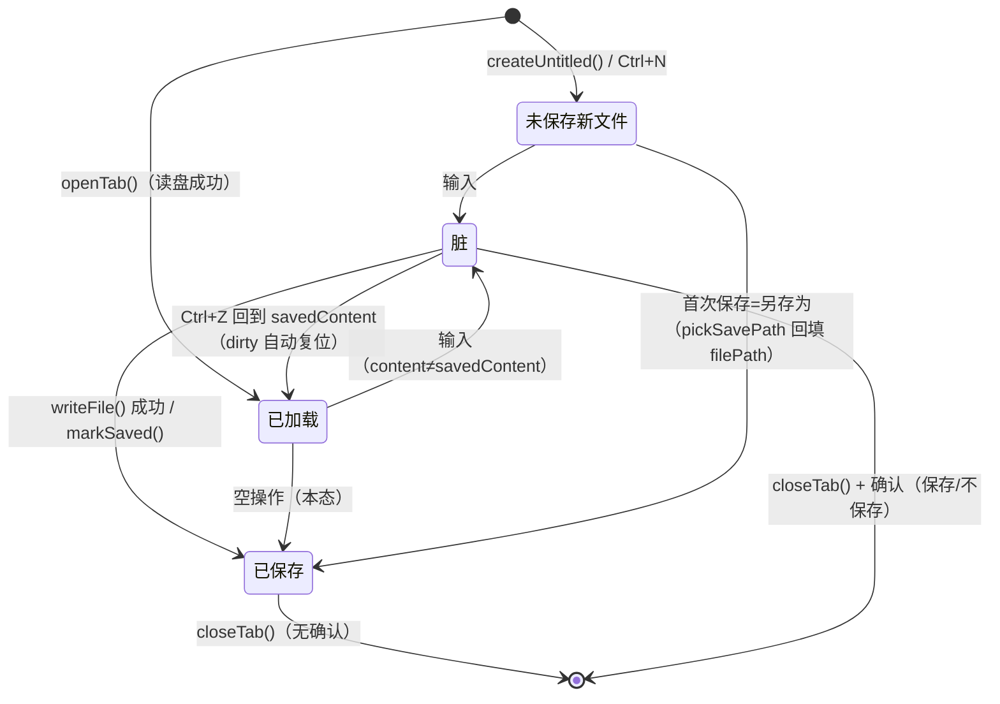

# aida-note 文件与状态管理架构（ARCH-2）

> 版本：v1.0 · 2026-08-20 · Sprint 1
> 依据：ARCH-1 模块分层（`app/docs/architecture.md`）/ SIS-ARCH-2
> 定位：FUNC-1（多标签编辑）及后续文件相关 SIS 的实现依据。本文档只做设计，不含实现。
> 范围外：自动保存与崩溃恢复（属 FUNC-10，届时另补设计附录）。

---

## 1. tabsStore 状态模型（单一来源）

> 原则：标签的全部状态（顺序、激活、内容、脏标记）只存在于 tabsStore，任何组件不得私存副本。

### 1.1 Tab 结构（TS 接口）

```ts
interface Tab {
  /** 唯一标识（自增 id，标签生命周期内不变） */
  id: number;
  /** 文件绝对路径；新建未保存文件为 null（isNewFile=true） */
  filePath: string | null;
  /** 标签标题：有文件取 basename，无文件为「未命名-N」 */
  title: string;
  /** 编辑器内容（CodeMirror doc 的同步镜像，唯一事实源为 store） */
  content: string;
  /** 内容最后保存到磁盘时的快照（脏判定基准，保存后更新） */
  savedContent: string;
  /** 语法高亮语言标识（FUNC-2 依据扩展名映射） */
  language: 'markdown' | 'javascript' | 'json' | 'html' | 'sql' | 'plaintext';
  /** 脏标记：content !== savedContent 的派生态（见 1.3） */
  dirty: boolean;
  /** 新建未保存文件（无 filePath），首次保存走「另存为」 */
  isNewFile: boolean;
}
```

### 1.2 Store 骨架（动作签名，供 FUNC-1 直接实现）

```ts
interface TabsStore {
  // 状态
  tabs: Tab[];              // 有序，即标签栏顺序
  activeTabId: number | null;

  // 派生
  readonly activeTab: Tab | null;

  // 动作
  openTab(input: { filePath: string; content: string } | { title: string }): void;
  closeTab(tabId: number, opts?: { force?: boolean }): Promise<boolean>;  // 见 §2
  setActive(tabId: number): void;
  moveTab(from: number, to: number): void;                                // 标签拖拽排序
  updateContent(tabId: number, content: string): void;                    // 见 §2.1
  markSaved(tabId: number, filePath?: string): void;                      // 另存为时回填 filePath
  createUntitled(): void;                                                  // 新建标签（Ctrl+N）
}
```

### 1.3 脏标记（立即置位）

- `updateContent()` 每次调用时立即重算：`dirty = content !== savedContent`。
  - 注意不是「变脏后永不复位」：用户 Ctrl+Z 回到与保存时一致的内容时，`dirty` 自动为 false（符合直觉，标签圆点消失）。
- `dirty` 为派生态但显式存于 Tab 上（避免每次渲染做全文比较；大数据量时性能考量，由 `updateContent` 单点维护）。

---

## 2. 脏标记与关闭确认流程

### 2.1 编辑置位流

```
CodeMirror updateListener ──> tabsStore.updateContent(tabId, doc.toString())
                          ──> tab.content = content
                          ──> tab.dirty = (content !== tab.savedContent)
                          ──> 标签圆点 UI 响应式更新
```

### 2.2 关闭确认（dirty 时弹窗，三选）

```
closeTab(tabId)
  ├─ tab.dirty === false ──> 直接移除标签（相邻标签自动补位激活）
  └─ tab.dirty === true  ──> 弹确认框（Naive UI Dialog）：
        ├─ [保存]   ──> fileService.writeFile() ──> 成功：markSaved + 移除标签
        │                                              └─ 失败：提示错误，标签保留
        ├─ [不保存] ──> 直接移除标签（内容丢弃）
        └─ [取消]   ──> 返回 false，标签保留
```

- **窗口关闭**（含 Ctrl+W 关全部 / 点窗口 X）：任一标签 dirty 时，逐个或合并提示（实现取合并提示：「N 个标签未保存」+ 三选），关闭被取消则中止整个退出。
- `force: true` 仅供 FUNC-10 崩溃恢复等内部流程使用，绕过确认。

### 2.3 状态迁移图



---

## 3. 文件读写契约（编码）

### 3.1 读取（fileService.readFile）

| 情形 | 处理 |
|------|------|
| 无 BOM | 按 UTF-8 解码（`fs.readTextFile` 默认行为） |
| UTF-8 BOM（`EF BB BF`） | 剥离 BOM 后返回正文；**记录 hadBom=true** |
| 非 UTF-8（如 GBK 乱码风险） | v1 不做转码（超出范围）：以「替换字符」呈现 + 状态栏提示「非 UTF-8 文件，可能乱码」；保存时按 UTF-8 写出（SIS 边界：轻便工具不做编码转换器） |

- 实现要点：`fs.readTextFile` 读出的 string 若含 `\uFEFF` 开头即视为 BOM，剥离去掉。
- `hadBom` 存于 Tab 的扩展字段（`savedContent` 不含 BOM），保存时原样补回（尊重原文件风格）。

### 3.2 写入（fileService.writeFile）

- 默认 UTF-8 无 BOM；原文件有 BOM 则写回时补 BOM（`hadBom` 为真）。
- 原子性：先写临时文件再 rename（plugin-fs 的 `writeTextFile` 在 Windows 上的覆盖语义足够，v1 不额外实现两段式；若实测丢数据再升级，走 T3 变更）。

---

## 4. settings.json 持久化结构

### 4.1 存储位置

- Tauri plugin-store：`settings.json`（应用配置目录，由插件管理路径，前端不感知绝对路径）。
- 读写时机：应用启动时 `settingsService.load()` 全量读取 -> settingsStore；任何变更（`save(patch)`）整体写回。

### 4.2 结构与 TS 接口

```ts
interface AppSettings {
  /** 主题：light / dark / system（FUNC-9 三态，默认 system） */
  theme: 'light' | 'dark' | 'system';
  /** 软换行：全局共享，默认开启（FUNC-8） */
  wordWrap: boolean;
  /** 最近文件：绝对路径数组，新的在前，去重，上限 20（FUNC-11） */
  recentFiles: string[];
  /** AI 接入配置（AI-1：单套 API，key 明文存储为既定决策） */
  aiConfig: {
    baseURL: string;   // 如 https://api.example.com/v1
    apiKey: string;    // 明文存于本地 settings.json（SIS-AI-1 既定）
    model: string;     // 模型名
  };
}

/** 部分字段缺省时的兜底（老版本 settings.json / 首次启动） */
const DEFAULT_SETTINGS: AppSettings = {
  theme: 'system',
  wordWrap: true,
  recentFiles: [],
  aiConfig: { baseURL: '', apiKey: '', model: '' },
};
```

- 兼容策略：load 时 `{ ...DEFAULT_SETTINGS, ...parsed }` 浅合并 + `aiConfig` 单独深合并，未知字段忽略（前向兼容）。

---

## 5. 一致性核查（SIS-ARCH-2 验收第 6 项）

| 检查点 | 结论 |
|--------|------|
| Tab 字段齐全 | ✓ id / filePath? / title / content / language / dirty / isNewFile（§1.1） |
| 脏标记 + 关闭确认（保存/不保存/取消） | ✓ §2.2 |
| 读写契约 UTF-8 + BOM 检测，保存默认 UTF-8 | ✓ §3 |
| settings.json 四字段 + TS 接口 | ✓ §4.2（theme / wordWrap / aiConfig / recentFiles） |
| 与 ARCH-1 分层一致 | ✓ tabsStore/settingsStore 单一来源、IO 经 fileService/settingsService、无 vue-router |
| 可被 FUNC-1 直接引用 | ✓ §1.2 动作签名即实现清单 |

---

*后续变更：本文档属建设资产，状态模型结构性变更（如 Tab 增删字段、脏标记语义变化）需走 T3 变更流程并同步 decision。*
