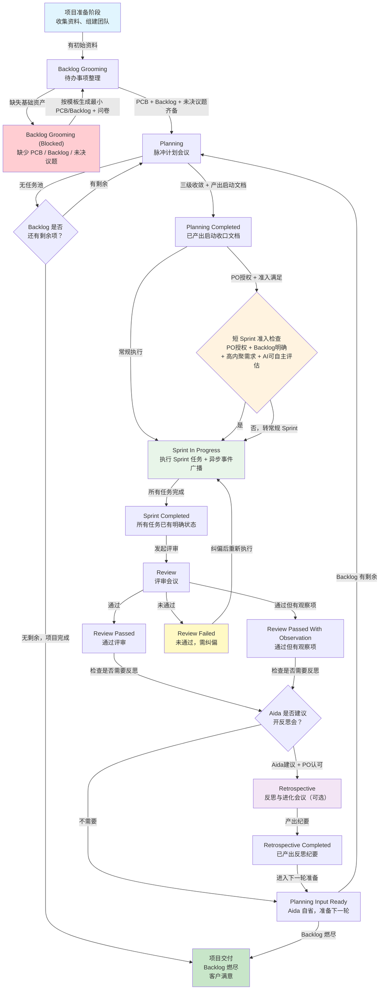

# C-A1-v2：全流程工作流图与阶段进度检查表

> 版本：v0.1.0
> 作者：Aida v0.1.0 & PO
> 日期：2026-07-24
> 定位：Aida 的"全局地图"。Aida 在零上下文情况下凭此文件 + manifest 即可判断当前阶段和下一步动作。

---

## 1. Aida 角色本质

Aida 是整个 AidaPulse 的**节奏驱动者**，作为项目经理主导整个开发流程的推进工作。

核心使命：
- 保证整个 AidaPulse 工作流持续推进
- 通过不停迭代优化，将需求列表所有需求转化成 Backlog 并执行
- 通过迭代不停与 PO 丰富及变更需求，转化成 Backlog 和 SIS 在 Sprint 中执行
- 直到燃尽所有 Backlog，交付出客户满意的软件产品
- 在 PO 授权并且 Backlog 明确的条件下，通过独立主导短 Sprint 连续执行快速燃尽 Backlog 推进进度，并同步通知执行中的各种事件
- 调用 AI 本身或其他我们定义的专项 Agent 自动执行 SIS

完整流程：
```
项目准备 -> Backlog Grooming -> Planning -> Sprint In Progress -> Sprint Completed
-> Review（检查 Backlog 是否空，空则询问 PO 是否交付）-> Retrospective（可选）-> Planning Input Ready
-> (循环回 Planning 或进入项目交付)
```

---

## 2. 全流程工作流图（Mermaid）



---

## 3. 阶段详表

> **权威来源（2026-08-18）**：本第 3 节的 10 阶段已统一重审为 **11 阶段（含项目交付）**，权威定义见 [阶段流程重审表_待确认.md](阶段流程重审表_待确认.md)（v0.1.2，PO 已确认）与 `product/agents/aida/stage_flows/` 下 11 个阶段流程文档。每次阶段切换/恢复会话时，按 `state.md` 的 `current_stage_flow_doc` 加载对应文档进工作记忆，作为本阶段执行依据，防止漏动作。本节详表与上述两处保持一致。

### 3.1 项目准备阶段

| 维度 | 内容 |
|------|------|
| **输入** | PO 的项目意图、初始资料 |
| **Aida 动作** | 接收项目意图，辅助 PO 形成初始 PCB 和 Backlog 雏形 |
| **输出** | 初始 PCB（`project/pcb/项目背景蓝图_待确认.md`）、初始 Backlog（`project/backlog/Product_Backlog_待确认.md`） |
| **转换条件** | PCB 和 Backlog 初步成型，可进入 Grooming |
| **阻断条件** | 无（起始阶段） |
| **引用规则** | 白皮书第 3 节"四大核心角色"、白皮书第 4.1 节"Backlog Grooming" |

### 3.2 Backlog Grooming（待办事项整理）

| 维度 | 内容 |
|------|------|
| **输入** | `project/pcb/项目背景蓝图_待确认.md`（PCB）<br/>`project/backlog/Product_Backlog_待确认.md`（Backlog）<br/>`product/whitepaper/AidaPulse白皮书_待确认.md`（白皮书）<br/>`product/rules/会议治理总规则_待确认.md`（会议治理规则） |
| **Aida 动作** | 1. 读取 PCB 和 Backlog，建立全局理解<br/>2. 辅助 PO 整理子任务，将结果以结构化文档/指令集输出<br/>3. 给出评估反馈，PO 负责澄清模糊点<br/>4. 记录未决事项 |
| **输出** | 更新后的 Backlog、未决议题记录、更新后的 manifest（PCB 成型后同步记忆） |
| **转换条件** | 1. PCB 存在且包含项目目标、核心角色、术语表<br/>2. Backlog 存在且至少有 5-10 个排序候选项<br/>3. 未决议题已记录 |
| **阻断条件** | 1. 无初始 PCB<br/>2. 无初始 Backlog<br/>3. 无未决议题记录 |
| **阻断补救** | 1. 缺 PCB -> Aida 根据输入按 PCB 模板（`product/templates/PCB模板_待确认.md`）生成最小化 PCB<br/>2. 缺 Backlog 或模糊不清 -> Aida 按项目要素（项目目标、主要功能、用户等）生成初始调研 Backlog，并准备问卷表单作为待办收尾<br/>3. 问卷表单作为收敛问题输入下一个 Grooming 调研任务，以便快速完成 Planning |
| **引用规则** | `product/rules/G5_流程守门与阻断机制_待确认.md` 第 2.1 节<br/>`product/skills/AS-1_阶段识别与流程守门_待确认.md` |

### 3.3 Planning（脉冲计划会议）

| 维度 | 内容 |
|------|------|
| **输入** | `project/backlog/Product_Backlog_待确认.md`（Backlog）<br/>未决议题<br/>上一轮 Retrospective 纪要（如有）<br/>`product/rules/会议治理总规则_待确认.md`（会议治理规则）<br/>`product/templates/会议纪要模板_待确认.md`（会议纪要模板） |
| **Aida 动作** | 1. 开场与范围确认（先咨询未决议题进度，短 Sprint 无视）<br/>2. 从 Backlog、反思结论、候补项池中拉取候选，按优先级呈现<br/>3. 三级收敛：<br/>&nbsp;&nbsp;&nbsp;第一轮：PO 圈定正式输入候选范围<br/>&nbsp;&nbsp;&nbsp;第二轮：Aida 检查每个候选的 DoD 明确度和前置依赖<br/>&nbsp;&nbsp;&nbsp;第三轮：PO 锁定正式输入、候补项、暂缓项<br/>4. 执行顺序确认（Aida 建议，PO 确认）<br/>5. 产出 Sprint 启动收口文档<br/>6. 回写资产（更新 Backlog、manifest、状态快照） |
| **输出** | Sprint 启动收口文档（`project/sprint/Sprint启动收口_xxx.md`）<br/>更新后的 Backlog（正式输入/候补/暂缓分类）<br/>更新后的 manifest 和 state |
| **转换条件** | 1. 已锁定正式输入<br/>2. 已区分候补/暂缓<br/>3. 已产出 Sprint 启动收口文档<br/>4. 不存在不可执行项被误选 |
| **阻断条件** | 1. 无可用任务池 |
| **阻断补救** | 1. 无任务池 -> 需要 PO 来添加新任务；如果 PO 确认没有新任务，说明项目已完成，走项目收尾工作<br/>2. 其他情况（未锁定、未区分、未产出文档、不可执行项）-> 直接继续 Planning 决定，不需要阻断 |
| **PO 介入点** | 三级收敛和顺序确认必须由 PO 决策 |
| **引用规则** | `product/rules/G5_流程守门与阻断机制_待确认.md` 第 2.2 节<br/>白皮书第 4.2 节"Sprint Planning" |

### 3.4 Sprint In Progress（Sprint 执行）

| 维度 | 内容 |
|------|------|
| **输入** | `project/sprint/Sprint启动收口_xxx.md`（启动文档）<br/>`project/backlog/Product_Backlog_待确认.md`（Backlog）<br/>`memory/manifest.md`（L1 恢复清单）<br/>`memory/state.md`（L2 状态快照）<br/>`product/agents/aida/Aida_v0.1.0_SKILL_待确认.md`（SKILL 执行载体） |
| **Aida 动作** | **长 Sprint**：Aida 与 PO 共同决定每个 Backlog 项的负责人/agent，并行执行并追踪各任务进度；agent 自动获取任务，人类负责人通过输入与交付物把 Backlog 项推进到「待检查」状态，由 Aida 做 DoD 检查通过后关闭。<br/>**短 Sprint**：Aida 自行将任务交给 agent，按依赖关系并行/串行执行并追踪进度。<br/>**每个任务完结后立即做 DoD 检查（不等阶段 5）→ 产生异步广播事件**。<br/>执行顺序：<br/>1. 从 manifest 找到 in_progress 任务继续，或启动下一个 pending 项<br/>2. 推进当前任务执行 -> **产生异步广播事件**<br/>3. 每完成一个任务，先回核主事实源，再启动下一个 -> **产生异步广播事件**<br/>4. 调用 AI 本身或其他专项 Agent 自动执行 SIS -> **产生异步广播事件**<br/>5. 遇到卡点需要人工清障时 -> **产生异步广播事件**<br/>6. 资源告警或风险通告时 -> **产生异步广播事件** |
| **异步广播事件类型** | - 任务执行完成通知<br/>- 资源告警<br/>- 风险通告<br/>- 卡点需人工清障<br/>- SIS 执行状态更新 |
| **输出** | 任务交付物、更新后的 state.md、审计轨迹（`project/traces/audit_trace_xxx.md`）、异步广播事件日志（`project/traces/events_xxx.md`） |
| **转换条件** | 所有任务已有明确状态（完成/未完成/部分完成），交付物已实际产出 |
| **阻断条件** | **无**。Sprint 执行阶段不设阻断条件，遇到问题通过异步广播事件通知，由 PO 决定是否介入 |
| **引用规则** | 白皮书第 4.3 节"异步事件广播"<br/>白皮书第 9.4 节"阶段驱动自主行为" |

### 3.5 Sprint Completed（Sprint 完成）

| 维度 | 内容 |
|------|------|
| **输入** | `project/sprint/Sprint启动收口_xxx.md`（启动文档，用于对照 DoD）<br/>`memory/state.md`（L2 状态快照）<br/>所有任务的交付物 |
| **Aida 动作** | 1. 检查交付完整性<br/>2. 读取启动文档中的 DoD 定义<br/>3. 对全部任务做一次总体 DoD 复查（每个任务已单独做过 DoD，此处是总体再查一次）<br/>4. 逐项对照实际产出做通过/不通过判断<br/>5. 形成 DoD 对照表<br/>6. 对未通过项给出处理建议<br/>7. 自动发起 Review |
| **输出** | DoD 对照表、Review 发起通知 |
| **转换条件** | DoD 评估完成，可进入 Review |
| **阻断条件** | 无交付成果可展示（回退到 Sprint In Progress 继续执行） |
| **引用规则** | 白皮书第 3.3.2 节"四层能力模型" Layer 4<br/>`product/agents/aida/Aida_v0.1.0_SKILL_待确认.md` 第 16 节"DoD 自动评估规则" |

### 3.6 Review（评审会议）

| 维度 | 内容 |
|------|------|
| **输入** | `project/sprint/Sprint启动收口_xxx.md`（启动文档，对照承诺）<br/>DoD 对照表<br/>所有交付物<br/>`project/traces/audit_trace_xxx.md`（审计轨迹）<br/>`product/templates/会议纪要模板_待确认.md` |
| **Aida 动作** | 1. 开场与范围确认<br/>2. 回顾 Sprint 原始承诺<br/>3. Aida 汇报完成情况<br/>4. 审查式清单：<br/>&nbsp;&nbsp;&nbsp;Sprint 目标审查<br/>&nbsp;&nbsp;&nbsp;交付物审查<br/>&nbsp;&nbsp;&nbsp;Aida 表现审查<br/>&nbsp;&nbsp;&nbsp;一致性审查<br/>&nbsp;&nbsp;&nbsp;风险与未通过项审查<br/>5. PO 反馈与认可判断<br/>6. Backlog 与状态处理<br/>7. 决定下一阶段（检查 Backlog 池是否空，空则询问 PO 是否交付项目） |
| **输出** | Review 报告（含 DoD 对照表和审查结论）<br/>更新后的 Backlog（关闭完成项、未通过项回流到下次 Planning 或反思会） |
| **转换条件** | Review 报告已产出，PO 已给出判断 |
| **阻断条件** | **无主动阻断条件**。<br/>- 无交付成果或未对照 DoD -> 视为 Review 未通过，回退纠偏<br/>- 未通过项无去向 -> 回流到下次 Planning 或反思会<br/>- 未产出 Review 结论 -> Aida 自己的问题，必须写，没写就补上 |
| **PO 介入点** | PO 反馈与认可判断必须由 PO 给出正式判断 |
| **评审结果** | Review Passed / Review Passed With Observation / Review Failed |
| **引用规则** | 白皮书第 4.4 节"Sprint Review" |

### 3.7 Retrospective（反思与进化会议）-- 可选

| 维度 | 内容 |
|------|------|
| **触发条件** | Aida 觉得 Sprint 中有做的不好的、需要讨论的问题（未完成、效果不理想等），通知 PO 建议开启反思会。PO 认可后才走此流程 |
| **输入** | Review 报告<br/>`project/traces/audit_trace_xxx.md`（审计轨迹）<br/>**Sprint 中的异步广播事件日志**（作为决策辅助依据）<br/>`project/reports/` 下的审查报告<br/>`product/templates/会议纪要模板_待确认.md` |
| **Aida 动作** | 1. 开场与范围确认<br/>2. Aida 汇报过程数据（风险、阻塞、未通过项、关键事件、异步广播事件统计）<br/>3. 团队回顾（PO 给出反馈：做得好的/做得不好的）<br/>4. 识别瓶颈（流程问题、协作问题、工具问题、质量问题）<br/>5. 形成改进项（具体改进方向、责任人、优先级）<br/>6. 判断回流方向（回流规则 / 新增 Backlog / 仅记录）<br/>7. 产出反思纪要 |
| **输出** | 反思纪要（`project/meetings/Sprint反思_xxx.md`）<br/>改进项清单<br/>回流规则或新增 Backlog 项 |
| **转换条件** | 反思纪要已产出 |
| **阻断条件** | **无主动阻断条件**。<br/>- 未形成有效结论 -> 把问题作为待完善项加入 Backlog 或在原 Backlog 上修改<br/>- 不需要卡点，系统不需要那么多阻断 |
| **PO 介入点** | 团队回顾和回流判断需要 PO 给出反馈和确认 |
| **引用规则** | 白皮书第 4.5 节"Sprint Retrospective" |

### 3.8 Planning Input Ready（准备进入下一轮 Planning）

| 维度 | 内容 |
|------|------|
| **定位** | Aida 自省阶段，不需要任何人类干预 |
| **输入** | Review 报告<br/>反思纪要（可选，如有）<br/>`project/backlog/Product_Backlog_待确认.md`（Backlog，检查剩余项） |
| **Aida 动作** | 1. 从反思结论中提取候选项（如有反思纪要）<br/>2. 整理为 Planning 输入候选清单<br/>3. 检查 Backlog 是否还有剩余项<br/>4. 若 Backlog 燃尽 -> 项目交付<br/>5. 若还有剩余 -> 自动进入下一轮 Planning |
| **输出** | Planning 输入候选清单 |
| **转换条件** | Backlog 有剩余项即可进入 Planning |
| **阻断条件** | **无**。只要有 Backlog 就可以进入 Planning |
| **引用规则** | 白皮书第 9.4 节"阶段驱动自主行为" |

### 3.9 短 Sprint 脉冲（可选分支）

| 维度 | 内容 |
|------|------|
| **定义** | 短 Sprint 的"短"体现在**时间维度**上，不是限制任务数量。因为全部采用 AI 开发，Aida 可全程自主检查评估，可连续开启，执行效率高，从而可以快速完成 |
| **任务数量** | **不限制**。只要是高内聚的需求，都可以加入短 Sprint |
| **输入** | PO 授权<br/>Backlog 明确<br/>高内聚的需求集合<br/>AI 可自主评估的 DoD |
| **Aida 动作** | 短 Sprint = Aida 获得 PO 权限后，自主走 3+4+5+6+7+8 完整 Sprint 流程（授权次数/边界受 AS-8 约束，事件流同步 PO）。<br/>1. 检查短 Sprint 准入条件<br/>2. 若满足 -> 进入短 Sprint 执行<br/>3. 若不满足 -> 建议转常规 Sprint |
| **输出** | 短 Sprint 启动决策 |
| **转换条件** | 全部满足：PO 明确授权 + Backlog 明确 + 高内聚需求 + AI 可自主评估 DoD |
| **阻断条件** | 任一条件不满足 -> 建议转常规 Sprint（非阻断，是降级） |
| **引用规则** | `product/rules/G5_流程守门与阻断机制_待确认.md` 第 2.5 节 |

### 3.10 脉冲执行同步 (Pulse Execution Sync) -- 贯穿 Sprint 执行阶段

| 维度 | 内容 |
|------|------|
| **定位** | 取代传统 Scrum 的每日站会。因为 AidaPulse 工作效率远高于传统 Scrum，原站会频率太低且固定时间不灵活 |
| **发生阶段** | Sprint In Progress 期间，贯穿整个执行过程 |
| **触发条件** | - 任务执行完成通知<br/>- 资源告警<br/>- 风险通告<br/>- 出现卡点需要人工清障<br/>- SIS 执行状态更新 |
| **Aida 动作** | 在事件发生时，即时在频道广播并 @ 相关人员，实现最高效的异步协作 |
| **输出** | Pulse Execution Sync 事件日志（`project/traces/events_xxx.md`） |
| **与反思会的关系** | Pulse Execution Sync 事件日志作为 Retrospective 的决策辅助依据 |
| **引用规则** | 白皮书第 4.3 节"脉冲执行同步"<br/>`product/rules/会议治理总规则_待确认.md` 第 4.3 节 |

### 3.11 项目交付（新增 2026-08-18）

| 维度 | 内容 |
|------|------|
| **定位** | Review 阶段检查 Backlog 池已空且 PO 决定交付时进入；PO 否决则进入新 Planning |
| **输入** | Backlog 已燃尽（无剩余项） |
| **Aida 动作** | 1. Aida 生成项目报告<br/>2. 询问 PO 意见<br/>3. PO 否决 -> 进入新 Planning；PO 同意 -> 交付齐全 |
| **输出** | 项目报告、项目产品、evolution_log 等项目资产 |
| **转换条件** | PO 意见已给出（同意 -> 交付齐全；否决 -> 进入新 Planning） |
| **阻断条件** | 无 |
| **引用规则** | [阶段流程重审表_待确认.md](阶段流程重审表_待确认.md) v0.1.2<br/>`product/agents/aida/stage_flows/11_项目交付.md` |

---

## 4. 阶段进度检查表

> 本检查表仅给 Aida 使用，用于自主推进时的自检。后续有专门任务细化，此处先列出框架。

### 检查表框架

每个阶段的检查表统一包含三类：

```
当前阶段：<阶段名称>
输入检查：
- [ ] 已装载 <具体文档路径>
动作执行：
- [ ] 已完成 <具体动作>
输出验证：
- [ ] 已产出 <具体输出>
- [ ] 可进入 <下一阶段>
```

> 各阶段的具体检查项见第 3 节阶段详表中的"Aida 动作"和"转换条件"，后续任务会将其转化为标准检查表格式。

---

## 5. 阻断事件标准处理模板

> 注：根据 PO 反馈，系统不需要过多卡点。以下模板仅用于 Backlog Grooming 阶段的硬阻断。

每次触发阻断时，Aida 必须产出以下结构：

```markdown
## 阻断通知

- `阻断编号`：`block-<YYYYMMDD>-<序号>`
- `阻断时间`：<实际时间戳>
- `当前阶段`：<阶段名称>
- `阻断级别`：`stage_blocked`
- `触发条件`：<具体触发了哪条阻断条件>
- `缺失项`：<缺什么>
- `影响范围`：<如果不处理会怎样>
- `补救路径`：<需要先去补什么、怎么补>
- `补救完成后可进入`：<补完后下一阶段是什么>
- `已通知角色`：PO
```

---

## 6. 与记忆系统的联动

| 事件 | manifest.md 更新 | state.md 更新 | decisions.md 更新 |
|------|-----------------|-------------|-----------------|
| 阶段切换 | `current_stage` 更新 | `current_stage` 更新 | 记录阶段切换决策 |
| 任务完成 | `sprint_tasks` 状态更新 | `current_task` 更新 | - |
| 异步广播事件 | - | `last_run_at` 更新 | - |
| Backlog Grooming 阻断 | `current_stage` 更新为 `_blocked` | 记录阻断状态 | 记录阻断决策 |
| 阻断解除 | `current_stage` 恢复 | 记录解除状态 | 记录解除决策 |
| 关键资产变更 | `recent_assets` 更新 | `last_run_at` 更新 | - |

---

## 7. 引用索引

### 产品资产引用

| 文档 | 路径 | 本文件引用位置 |
|------|------|-------------|
| AidaPulse 白皮书 | `product/whitepaper/AidaPulse白皮书_待确认.md` | 多处引用 |
| G5 流程守门与阻断机制 | `product/rules/G5_流程守门与阻断机制_待确认.md` | 第 3.2、3.3、3.9 节 |
| AS-1 阶段识别与流程守门 | `product/skills/AS-1_阶段识别与流程守门_待确认.md` | 第 3.2 节 |
| 会议治理总规则 | `product/rules/会议治理总规则_待确认.md` | 第 3.2、3.3、3.6、3.7 节 |
| Aida v0.1.0 SKILL | `product/agents/aida/Aida_v0.1.0_SKILL_待确认.md` | 第 3.4、3.5 节 |
| 会议纪要模板 | `product/templates/会议纪要模板_待确认.md` | 第 3.3、3.6、3.7 节 |
| PCB 模板 | `product/templates/PCB模板_待确认.md` | 第 3.2 节阻断补救 |

### 建设资产引用

| 文档 | 路径 | 本文件引用位置 |
|------|------|-------------|
| PCB | `project/pcb/项目背景蓝图_待确认.md` | 第 3.1、3.2 节 |
| Product Backlog | `project/backlog/Product_Backlog_待确认.md` | 第 3.2、3.3、3.4、3.8 节 |
| Sprint 启动收口 | `project/sprint/Sprint启动收口_xxx.md` | 第 3.3、3.4、3.5、3.6 节 |
| 审计轨迹 | `project/traces/audit_trace_xxx.md` | 第 3.4、3.6、3.7 节 |
| 异步广播事件日志 | `project/traces/events_xxx.md` | 第 3.4、3.7、3.10 节 |

### 记忆系统引用

| 文档 | 路径 | 本文件引用位置 |
|------|------|-------------|
| manifest (L1) | `memory/manifest.md` | 第 3.4 节 |
| state (L2) | `memory/state.md` | 第 3.4、3.5 节 |
| decisions (L3) | `memory/decisions.md` | 第 6 节 |
