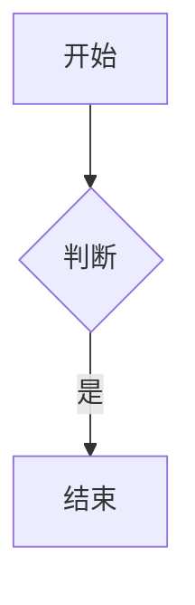

# aida-note 使用手册

> 版本：v0.1.0 ｜ 适用产品：aida-note（轻便全能文本编辑器）｜ 更新：2026-08-22

---

## 1. 产品简介

aida-note 是一款**轻便全能文本编辑器**（Tauri 2 桌面应用），定位对标 Notepad++ + Typora 的杂交：既轻快，又能所见即所得地写 Markdown，并集成了格式化、对比、搜索替换、主题、自动保存与 AI 辅助能力。

### 核心能力一览

| 类别 | 能力 |
|------|------|
| 编辑 | 多标签文件编辑、5 种语法高亮（HTML / JS / JSON / Markdown / SQL）、软换行、撤销/重做 |
| Markdown | 同屏所见即所得（标题/列表/表格/图片/代码块等 12 类元素实时渲染）、mermaid 图表实时渲染与导出 |
| 效率 | 代码格式化（HTML/JS/JSON/Markdown）、双栏文件对比、搜索/替换 |
| 体验 | 明/暗/跟随系统主题 + 蓝/绿/紫强调色、最近文件、自动保存与崩溃恢复 |
| AI | 润色（改写/润色/缩短/扩写）、选中文本问答、mermaid 语法修复 |

## 2. 安装

- **方式一（安装包）**：运行安装包（MSI 或 NSIS exe，见交付目录 `dist-install/`），按向导安装完成。
- **方式二（源码运行）**：
  - 前置：Node.js ≥ 18、Rust 工具链（仅桌面运行需要）
  - `npm install` → `npm run tauri dev`（开发调试）或 `npm run tauri build`（打包）
  - 浏览器调试：`npm run dev` 后访问 `http://localhost:1420`

> 首次使用提示：AI 功能需在「AI 面板 → 去设置」中填写你的 API 配置（baseURL / Key / Model，OpenAI 兼容协议），详见 §7。

## 3. 界面布局

```
┌──────────────────────────────────────────────────────────┐
│ 工具栏：新建 打开 保存 另存为 最近 | 撤销 重做 | 搜索 格式化 换行 对比 │ AI 润色 修复mermaid AI面板 主题 │
├──────────────────────────────────────────────────────────┤
│ 标签栏：[未命名-1] [hello.md] ×                          │
├──────────────────────────────────────────────────────────┤
│                                                          │
│                   编辑区（CodeMirror）                    │
│                                                          │
├──────────────────────────────────────────────────────────┤
│ 状态栏：行号 / 列号               语言 ▾           N 个未保存 │
└──────────────────────────────────────────────────────────┘
```

- **工具栏**：常用操作入口（悬停有说明）。
- **标签栏**：多标签切换、关闭（中键或 ×）。
- **编辑区**：主编辑区；无标签时显示「最近文件」空态页。
- **状态栏**：光标行列、语言切换（下拉）、未保存计数。
- **AI 面板**：可折叠的右侧问答侧栏（320px），工具栏「AI 面板」开关。

## 4. 基础编辑

### 4.1 文件操作

| 操作 | 方式 |
|------|------|
| 新建 | 工具栏「新建」或 `Ctrl+N` |
| 打开 | 工具栏「打开」或 `Ctrl+O`（也可把文件拖入窗口） |
| 保存 | 工具栏「保存」或 `Ctrl+S` |
| 另存为 | 工具栏「另存为」或 `Ctrl+Shift+S` |
| 最近文件 | 工具栏「最近」下拉（自动记录打开/保存过的文件，最多 20 个，置顶去重；文件失效会提示并移除） |

### 4.2 编辑操作

- 撤销 / 重做：`Ctrl+Z` / `Ctrl+Y`（或工具栏按钮）。
- 软换行：工具栏「换行：开/关」切换（默认开启；只影响显示，不写入换行符；全局共享，重启记住）。
- 语言切换：状态栏「语言 ▾」下拉（自动识别 + 手动覆盖，每个标签独立）。
- 语法高亮：HTML / JS / JSON / Markdown / SQL。

### 4.3 搜索 / 替换（`Ctrl+F`）

- 顶部浮动搜索框：输入即高亮全部匹配 + 显示「N 个匹配」计数。
- 三个开关：大小写敏感 / 全词匹配 / 正则表达式（非法正则提示「正则无效」）。
- `Enter` / `Shift+Enter`：下一处 / 上一处跳转。
- 「替换」：替换当前匹配；「全部替换」：替换所有匹配。均可 `Ctrl+Z` 撤销。
- `Esc` 关闭。

### 4.4 代码格式化（`Ctrl+Shift+F`）

- 支持 HTML / JS / JSON / Markdown（SQL 置灰不支持）。
- 整文件原地格式化，可 `Ctrl+Z` 撤销；语法错误时提示「格式化失败」并保持原文。

## 5. Markdown 所见即所得

### 5.1 实时渲染

- **光标所在块显示源码，其余块显示渲染效果**（Typora 式）：标题、加粗、斜体、删除线、行内代码、链接、图片、列表、引用、代码块、分隔线、表格 12 类元素。
- 光标移入某个块 → 该块回源码态可编辑；移出 → 恢复渲染态。
- 故障回退：未闭合/坏语法元素自动回退为源码显示，不崩溃。

### 5.2 mermaid 图表

在 Markdown 中写 ```` ```mermaid ```` 围栏块，移出光标后自动渲染为图表：

````markdown

````

- **点击图表** → 光标进入该块源码态可修改；移出后重新出图。
- **图表工具条**（渲染态右下角）：缩放查看 / 导出 SVG / 导出 PNG。
- **语法错误**：显示错误占位（可展开错误详情）+ 「编辑源码」回退 + 「AI 修复」（见 §7.4）。
- 主题联动：编辑器明暗主题切换时图表自动重渲染。

## 6. 对比 / 主题 / 自动保存

### 6.1 双栏文件对比

- 工具栏「对比」→ 两种源：**打开两个文件对比**（各自自动开标签，合并写回原标签并置脏）或 **当前文件 vs 剪贴板**（剪贴板只读）。
- 双栏并排：行级增删高亮 + 行内字符级差异高亮；差异计数「当前 / 总块」。
- 顶部「上一处 / 下一处」跳转差异块；双栏滚动联动。
- 底部「接受左 → 右 / 右 → 左」合并方向（只读侧不可接受）；合并写回标签并标记未保存，可继续保存。

### 6.2 主题切换

- 工具栏「主题」下拉：**亮色 / 暗色 / 跟随系统**（系统明暗变化实时联动）+ **强调色**（蓝 / 绿 / 紫）。
- 重启记住上次选择（settings.json）。

### 6.3 自动保存与崩溃恢复

- 编辑未保存内容后**自动写草稿**（防抖，不替代手动保存）。
- 意外退出/崩溃后重启：弹窗「检测到未保存的草稿」→ **恢复**（内容回填并置脏，可继续保存）或 **丢弃**（全部丢弃）。
- 草稿自动清理：正常退出、恢复/丢弃后、超过 7 天未使用，均不留碎片。

## 7. AI 功能（需先配置 API）

### 7.1 配置 API

1. 工具栏「AI 面板」→ 若未配置显示「未配置 API → 去设置」。
2. 填写三项并保存：
   - **baseURL**：OpenAI 兼容接口地址（如 `https://api-inference.modelscope.cn/v1`）
   - **API Key**：你的密钥（明文保存在本机 settings.json）
   - **Model**：模型名（如 `Qwen/Qwen3.5-122B-A10B`）
3. 未配置或请求失败时，功能给出明确提示、**不会崩溃**。

### 7.2 AI 润色（选中文本四选）

- **入口一（右键菜单）**：选中文本后右键 →「AI 润色」→ 改写 / 润色 / 缩短 / 扩写。
- **入口二（工具栏）**：选中文本后工具栏「AI 润色」下拉 → 四选。
- 结果以**流式打字机效果**呈现，气泡内**字符级 diff 高亮**（绿色=新增、红色删除线=删减）：
  - **接受**：原位替换选中文本（一次操作，可 `Ctrl+Z` 撤销）。
  - **放弃**：原文不动。
  - 生成中可「停止」。

### 7.3 AI 问答（选中文本上下文）

1. 在编辑器**选中文本**（作为问答上下文；无选中时发送会提示「请先选中」，且不会携带全文）。
2. 工具栏「AI 面板」打开侧栏 → 底部输入问题 → `Enter` 发送（`Shift+Enter` 换行；生成中可「停止」）。
3. 回答流式返回；每条回答下方「**插入到光标处**」一键把回答插入编辑器。

### 7.4 AI 修复 mermaid

- **入口一**：mermaid 语法错误占位的「**AI 修复**」按钮。
- **入口二**：工具栏「**修复 mermaid**」按钮（修复文档中第一个 mermaid 块）。
- AI 返回修正后的代码并替换源码 → 图表自动重新渲染。

## 8. 快捷键速查

| 快捷键 | 功能 |
|--------|------|
| `Ctrl+N` / `Ctrl+O` / `Ctrl+S` / `Ctrl+Shift+S` | 新建 / 打开 / 保存 / 另存为 |
| `Ctrl+Z` / `Ctrl+Y` | 撤销 / 重做 |
| `Ctrl+F` | 搜索 / 替换（`Enter`/`Shift+Enter` 跳转） |
| `Ctrl+Shift+F` | 代码格式化 |
| `Enter`（AI 面板） | 发送问题 |
| `Shift+Enter`（AI 面板） | 输入框换行 |

## 9. 常见问题

| 问题 | 处理 |
|------|------|
| 打开文件没反应？ | 确认是文本文件且未被占用；最近列表中的失效项会提示「文件不存在」并自动移除 |
| Markdown 块显示源码不渲染？ | 光标在块内属正常；移出光标后自动渲染；若仍不渲染检查语法（故障回退） |
| mermaid 图表不出现？ | 确认围栏为 ```` ```mermaid ```` 且语法正确；错误时会显示错误占位（可展开详情或 AI 修复） |
| AI 提示未配置？ | 在 AI 面板「去设置」填写 baseURL/Key/Model 并保存 |
| AI 回答很慢？ | 取决于所配模型与网络（流式输出，耐心等待或点「停止」） |
| 设置存哪？ | 桌面环境：app 配置目录 settings.json；浏览器调试：localStorage（`aida-note-settings`） |

## 10. 已知边界（明确不做）

- 不做多套 API 配置切换、函数调用 / RAG 知识库、AI 代码补全。
- SQL 不支持格式化（仅高亮）。
- 无文件树 / 多窗口 / 跨文件搜索 / 脚本运行。

---

*手册随产品版本维护；发现不一致请反馈。*
